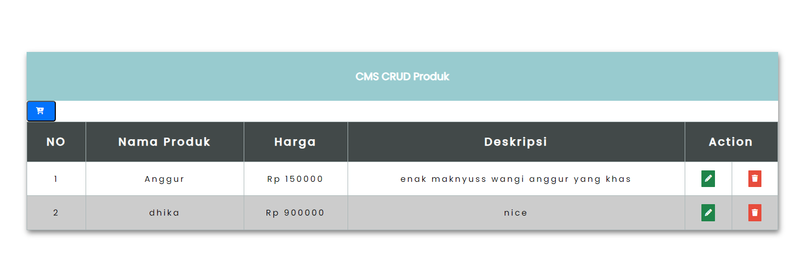

# Proyek CMS Produk

Proyek ini adalah aplikasi **Content Management System (CMS)** sederhana untuk mengelola produk menggunakan PHP dan SQLite. Aplikasi ini memungkinkan pengguna untuk menambah, mengedit, dan menghapus produk serta melihat daftar produk yang tersimpan di database.



## Fitur

- Menambahkan produk baru ke dalam sistem.
- Mengedit produk yang sudah ada.
- Menghapus produk dari daftar.
- Menampilkan semua produk dalam bentuk tabel yang rapi.

## Teknologi yang Digunakan

- **Bahasa Pemrograman**: PHP
- **Database**: SQLite
- **Frontend**: HTML, CSS
- **Ikon**: Font Awesome

## Instalasi

1. **Clone Repository**
   ```bash
   git clone https://github.com/username/repository-name.git
